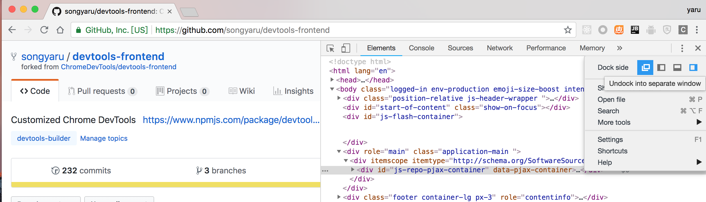
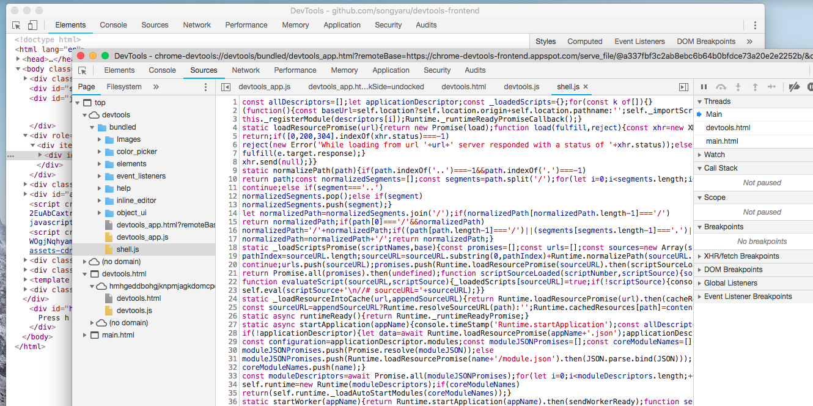
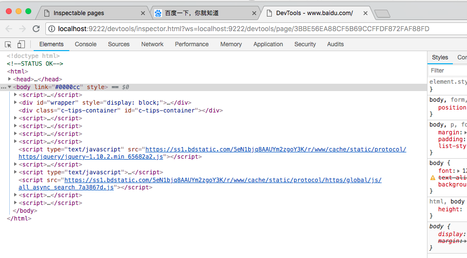

## 如何定制 chrome 开发者工具

### 1.chrome 远程调试中的开发者工具是什么

先将开发者工具打开并选择 undock 



然后再打开开发者工具页面的开发者工具


打开 source 面板可以发现开发者工具页面的内容都是静态的 HTML CSS JS 资源。




### 2.获取源码

[chromium devtools 源码](https://chromium.googlesource.com/chromium/src/+/master/third_party/blink/renderer/devtools/)
或者 [github 上的备份](https://github.com/ChromeDevTools/devtools-frontend)


### 3.build
由于 chrome devtools 是随着 chromium 通过 Ninja 编译一起被 build 出来，这个过程太复杂而且费时。

通过分析 [BUILD.gn](https://github.com/ChromeDevTools/devtools-frontend/blob/master/BUILD.gn) 文件,发现 devtools 编译是通过执行 script 目录下的 python 脚本完成的。因此我们只需要重写这部分的调用脚本就可以不去配置繁琐的 chromium 编译环境。参见 [devtools-frontend-builder](https://github.com/songyaru/devtools-frontend)，利用 gulp 重新打包 build。

#### 提取所有文件路径

从 [BUILD.gn](https://github.com/ChromeDevTools/devtools-frontend/blob/master/BUILD.gn) 文件中发现，gn脚本脚本定义了一些文件路径的变量。把这些变量抽取到 [path_const.js](https://github.com/songyaru/devtools-frontend/blob/master/builder/path_const.js) 中

#### gulp 脚本
[BUILD.gn](https://github.com/ChromeDevTools/devtools-frontend/blob/master/BUILD.gn)  
```
action("build_debug_devtools") {
   script = "scripts/build/build_debug_applications.py"

   deps = [
     ":copy_generated_scripts",  // gn 脚本中的 deps 对应  glup task 的依赖。 
   ]
}   
```
入口的action 对应 gulp [build.js](https://github.com/songyaru/devtools-frontend/blob/master/builder/build.js) 中的一个 gulp task
```
gulp.task('build', ['devtools_frontend_resources'], () => {
    const script = getSourcePath(process.env.NODE_ENV === 'dev' ?
        'scripts/build/build_debug_applications.py' :
        'scripts/build/build_release_applications.py');
	// ......	
	const input = getSourcePath('front_end');
    const output = getOutputPath();
    return run(`python ${script} ${devtools_applications} --input_path ${input} --output_path ${output}`).exec();

})
```

按照这个固定的规律就可以把整个 gn 脚本迁移到 gulp 脚本。实现在 node 环境 devtools 工程的 Build 打包


#### 其他资源
由于新版 chromium 源码代码结构的变化，有些文件需要单独下载。如 [protocol.json](https://github.com/ChromeDevTools/devtools-frontend/blob/master/protocol.json) 里面明确说明了该文件被分成了两部分。

类似这些文件统一放在了 [dep 目录](https://github.com/songyaru/devtools-frontend/blob/master/builder/dep/)

### 4.运行
devtools-frontend 工程默认有脚本 ```npm run start``` 启动开发者工具。分析 package.json 是 node 执行  start_chrome_and_server.js
```
"start": "node scripts/start_chrome_and_server.js",
```
[start_chrome_and_server](https://github.com/ChromeDevTools/devtools-frontend/blob/master/scripts/start_chrome_and_server.js)
```
var childProcess = require('child_process');
var path = require('path');

var chrome = childProcess.fork(path.join(__dirname, 'chrome_debug_launcher/launch_chrome.js'), process.argv.slice(2));
var server = childProcess.fork(path.join(__dirname, 'hosted_mode/server.js'));

chrome.on('exit', function() {
  server.kill();
});


```
修改 [scripts/hosted_mode/server.js 第14行](https://github.com/ChromeDevTools/devtools-frontend/blob/master/scripts/hosted_mode/server.js) 
```
const devtoolsFolder = path.resolve(path.join(__dirname, '../../../builder/output/'));

```
将 devtoolsFolder 指向上面 build 的输出路径。再执行 ```npm start ``` 自动打开d Chrome Canary 。打开 http://localhost:9222/ 可以查看所有的可调试页面。



### 5.其他

以上所有的修改请参考 [Chrome DevTools Frontend Build Tools](https://github.com/songyaru/devtools-frontend)


