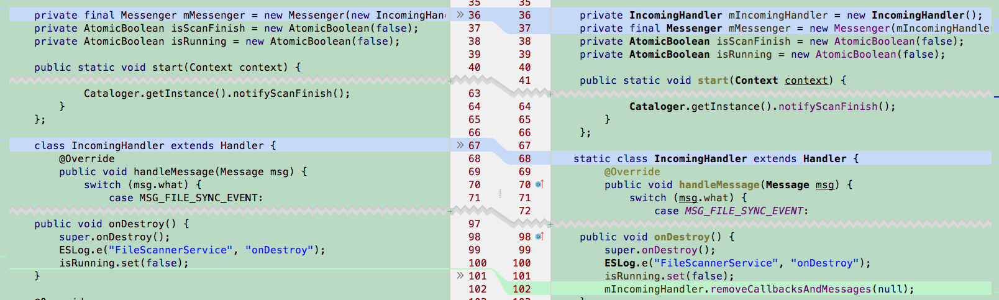
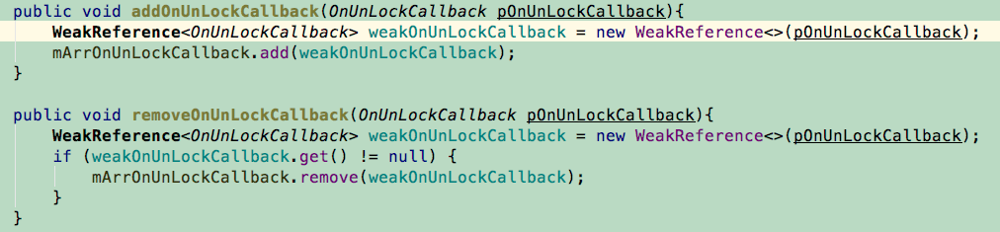

## Handler 匿名内部类、非静态内部类

### 如何避免
1：使用静态内部类，加上static 修饰

2：使用WeakReference

``` 
private static class MyHandler extends Handler {
    WeakReference<HandlerActivity> weakReference;

    public MyHandler(HandlerActivity activity) {
        weakReference = new WeakReference<HandlerActivity>(activity);
    }

    @Override
    public void handleMessage(Message msg) {
        super.handleMessage(msg);
        if (weakReference.get() != null) {
            ...
        }
    }
}
```   

3：根据业务情况在 onDestroy 中移除回调、取消异步任务
``` 
  protected void onDestroy() {
    super.onDestroy();
    myHandler.removeCallbacksAndMessages(null);
    myAsyncTask.cancel(true ) ;
  }
``` 

## 静态变量


静态变量的生命周期是在类加载时开始，类卸载时结束。进程没有被杀死，静态变量就会一直存在。 如果静态变量强应用了 Activity 中的变量，那当这个 Activity 销毁也不会被释放。

### 如何避免

1.寻找和静态变量生命期差不多的替代
如 单例中的 ```context``` 使用 ```ApplictionContext``` 代替

2.强引用改成弱引用

如 WeakHashMap WeakReference

## 监听器有 add 没有 remove

### 如何避免

1.onDestroy 时调用 remove

2.使用 WeakReference （不推荐, 优先调用 remove 来解决，谁创建谁回收）

3.考虑使用 EventBus ？？


资源未关闭

使用了BraodcastReceiver， Cursor， Bitmap，ContentObserver，Callback 等资源，当不再需要时，需要释放掉

### 代码方面的问题
1.Bitmap 没有 recycle

2.Adapter 没有使用 converView

3.注册事件没有 remove

4.其他。。。。