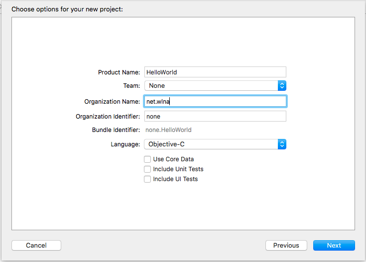
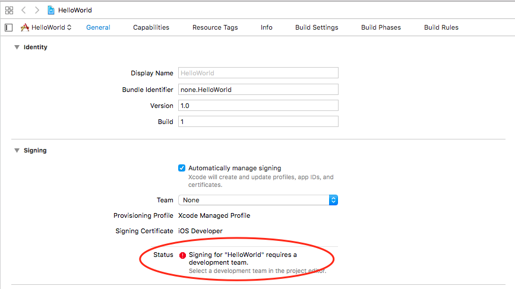
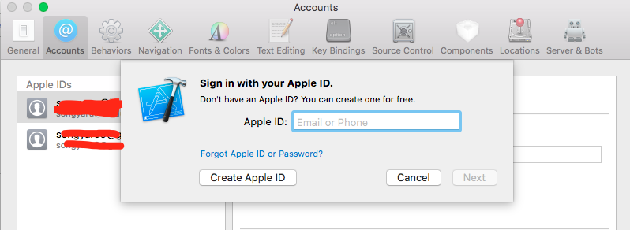
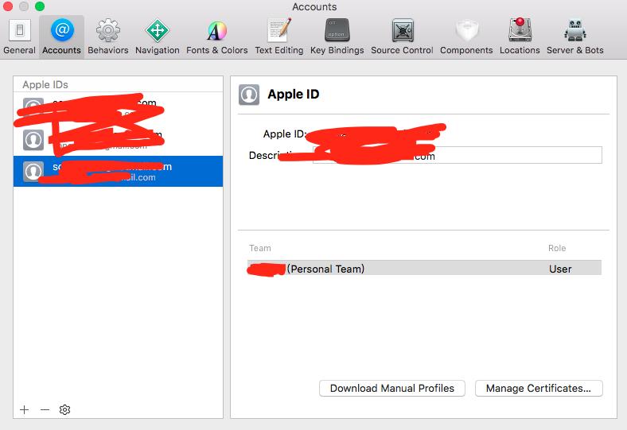
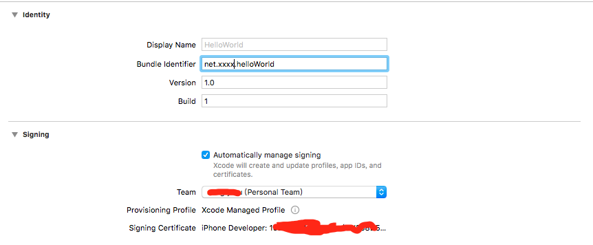
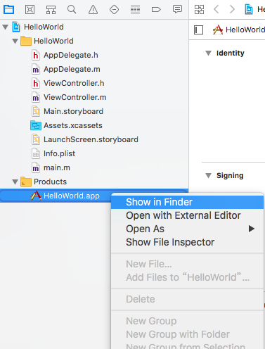
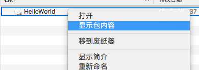
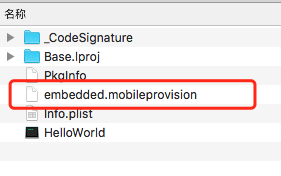
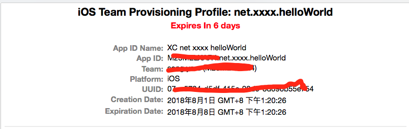
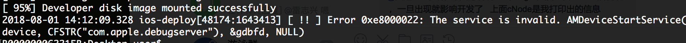

## 为什么要替换签名
开发阶段，用开发者账号 build 出来的 app 可以很方便的调试，
但是苹果应用商店中的 app 使用 Distribution 签名，无法直接打开 webview 的远程调试。
因此我们通过替换 ipa 包签名方式改成开发者的签名实现远程调试。

### 获取 embedded.mobileprovision
用 xcode 创建一个 helloWorld 工程

   

打开后提示没有签名的信息，点击 Team 下拉框 -> Add an Account...  

     

登录账号，如果没有自行申请一个(账号不需要付费)  

     

如图所示，账号类型是 Personal Team。关闭该页面  

   

Team 中选中刚才创建的账号 （注：如果之前已经有开发者账号，直接选中，不需要上面的步骤）
勾选了 automatically manage signing 后会自动的加上签名信息。

   

选择真机,点击运行按钮确保 helloWorld 能装到手机上

   
 
随后在 finder 中查看 build 完成后的目录

   

显示包内容

   

   

embedded.mobileprovision 就是我们需要的签名文件

   

预览该文件可以发现，苹果限制了有效期只有7天。所以这种方式装上的 app 7天后不能打开了，好在只是调试用，过期了可以再 build 一遍

记住App ID : 本例是 net.xxxx.helloWorld,后面的脚本需要填入

### 获取开发者账号信息
```
security find-identity -p codesigning -v
```
   

记住 iPhone Developer 前那一串字符，后面的脚本需要填入。

### 获取 ipa
由于新版的 itunes 不再提供 ipa 下载，并且苹果商店下载的 app 经过了加壳处理，因此还需要砸壳（dumpdecrypted）才能使用。
为了省事，可以直接从同步助手的越狱商店下载已经砸壳的 app。具体请自行百度，本文不提供地址。


### 替换签名
以微信为例，将 wechat.ipa 和 embedded.mobileprovision 放在用一目录，新建一个 wechat.sh 文件脚本内容如下：

```shell
appPath="./wechat.ipa" # app 安装包相对路径

embeddedPath="./embedded.mobileprovision" # 签名相对路径

signCode="xxxxxxxxxxxxxxxxxxCC9B7E47CFA71F2E404F2F" # 账号签名字符串,查看方式： security find-identity -p codesigning -v

appId="net.xxxx.helloWorld" #App ID Name

unzip -o ${appPath} -d extracted

APPLICATION=$(ls extracted/Payload/) 

rm -fr extracted/Payload/${APPLICATION}/Watch

rm -fr extracted/Payload/${APPLICATION}/Plugins

security cms -D -i ${embeddedPath} > extracted/embedded_full.plist

/usr/libexec/PlistBuddy -x -c 'Print:Entitlements' extracted/embedded_full.plist > extracted/embedded.plist

cp ${embeddedPath} extracted/Payload/${APPLICATION}/embedded.mobileprovision

/usr/libexec/PlistBuddy -c "Set :CFBundleIdentifier ${appId}" extracted/Payload/${APPLICATION}/Info.plist 

rm -rf extracted/Payload/${APPLICATION}/_CodeSignature/

/usr/bin/codesign --force --sign ${signCode} --entitlements extracted/embedded.plist extracted/Payload/${APPLICATION}/Frameworks/*

/usr/bin/codesign --force --sign ${signCode} --entitlements extracted/embedded.plist extracted/Payload/${APPLICATION}/${appName}       
   
ios-deploy --bundle extracted/Payload/${APPLICATION}

rm -fr extracted

```
由于 ipa 文件现在 itunes 无法安装，因此脚本里面用到了 ios-deploy。

该命令通过 ```npm install -g ios-deploy --unsafe-perm=true``` 安装

最后在命令行中执行 ```sh wechat.sh``` 即可安装到手机中

   

最后可能会出现上面这个错误，需要把开发者加入手机的信任中

### IOS 设备中把开发者加入信任
设置 -> 通用 -> 设备管理 -> 开发者应用 -> 点击信任

手机上再次打开微信，随便打开一个小程序，在 safari 中就可以远程调试了。


### 后记
附 [adb-devtools](https://www.npmjs.com/package/adb-devtools) 工具，可以更方便的使用 chrome 连接 ios 和 android 设备进行远程调试。

替换签名的方案不仅可用于 webview 的远程调试，还能用于应用多开，lldb 调试，开发过程中的内部测试等等很多玩法。
